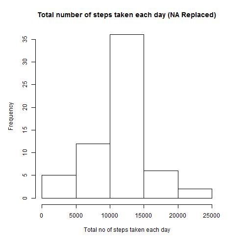

# Reproducible Research: Peer Assessment 1


## Loading and preprocessing the data

```r
if (!(file.exists("activity.csv"))) {
	url<- "http://d396qusza40orc.cloudfront.net/repdata%2Fdata%2Factivity.zip"
	download.file(url,"repdata_data_activity.zip")
	unzip("repdata_data_activity.zip")
}

if(!require(data.table)){install.packages("data.table")}
Sys.setlocale("LC_TIME", "English")
```

```
## [1] "English_United States.1252"
```

```r
odt<-fread("activity.csv",header=TRUE,na.strings="NA",stringsAsFactors=FALSE)

#Omit the data which are NA's.
dt<-na.omit(odt)

dt$date<-as.IDate(strptime(dt$date,format="%Y-%m-%d"))
```

## What is mean total number of steps taken per day?


```r
#This speeds up the process.
setkey(dt,date)

sumDt<-dt[,sum(steps),by=date]
setnames(sumDt,c("date","steps"))

#Calculate the mean and median.
lMean=mean(sumDt$steps)
lMedian=median(sumDt$steps)

par(mar=c(6,5,4,4))

with(sumDt,hist(steps,main="Total number of steps taken each day",xlab="Total no of steps taken each day"))
```

 


10766.19 is the mean and 10765 is the median of total number of steps taken per day.

## What is the average daily activity pattern?


```r
#Calculate the average.
avgDt<-dt[,mean(steps),by=interval]
setnames(avgDt,c("interval","steps"))

par(mar=c(6,5,4,4))
with(avgDt,plot(interval,steps,type="l",main="Average Number Of Steps Taken", xlab="Time",ylab ="Average Steps",xaxt="n"))
axis(1, labels = c('0:00', '5:00', '10:00', '15:00', '20:00'), at = c(0, 500, 1000, 1500, 2000))

#Calculate the interval where steps are maximum (average).
intervalMaxSteps<-avgDt[which.max(avgDt$steps),]$interval

#Draw a line to highlight the interval where the steps are maximum.
abline(v=intervalMaxSteps,lty=2,col="red")
```

 

835 is the 5-minute interval which contains the maximum number of steps (averaged across all the days in the dataset), and from the graph it is at 8.35

## Imputing missing values


```r
noOfNARows<-sum(!complete.cases(odt))
```

2304 is the total number of rows with NAs.


```r
#Replacing the missing value with the mean of steps for that interval.

mOdt<-data.table(data.frame(t(apply(odt,1,FUN=function(row,avgDt){if(is.na(row[1])){row[1]=(avgDt[interval==gsub("^\\s+|\\s+$", "", row[3])]$steps)};row},avgDt=avgDt)),stringsAsFactors=FALSE))

#apply coerces the columns type to string, convert them back to relevant types.

mOdt$interval<-as.integer(gsub("^\\s+|\\s+$", "",mOdt$interval))
mOdt$date<-as.IDate(strptime(mOdt$date,format="%Y-%m-%d"))
mOdt$steps<-as.integer(mOdt$steps)

#Calculate the total steps.

setkey(mOdt,date)
mSumDt<-mOdt[,sum(steps),by=date]
setnames(mSumDt,c("date","steps"))

# Calculate the mean and median.
lMMean=mean(mSumDt$steps)
lMMedian=median(mSumDt$steps)

par(mar=c(6,5,4,4))

with(mSumDt,hist(steps,main="Total number of steps taken each day (NA Replaced)",xlab="Total no of steps taken each day"))
```

 

10749.77 is the mean and 10641 is the median of total number of steps taken per day (After replacing NA with mean of that 5 minute interval). Mean and Median decreased slightly when NA values are replaced with mean of the interval.

## Are there differences in activity patterns between weekdays and weekends?


```r
#Build a factor variable (weekday,weekend) around date.

new.levels<-c("weekday","weekday","weekend","weekend","weekday","weekday","weekday")
mOdt$wd<-factor(new.levels[factor(weekdays(mOdt$date))])
avgMOdt<-aggregate(steps~interval+wd,data=mOdt,mean)

if(!require(ggplot2)){install.packages("ggplot2")}
if(!require(grid)){install.packages("grid")}

#Changing the order of the factor variable so that weekend comes first before weekday (in graph panel).
avgMOdt$wd<-factor(avgMOdt$wd,levels=c("weekend","weekday"))

g<-ggplot(avgMOdt,aes(x=interval,y=steps))
g<-g+geom_line(colour="blue")
g<-g+facet_wrap( ~ wd, ncol=1)
g<-g+labs(y="Number of steps",x="Interval")
g<-g+theme(axis.title.y=element_text(vjust=2.0))
g<-g+theme(axis.title.x=element_text(vjust=-0.9))
g<-g+theme(plot.margin=unit(c(0.5,0.5,0.5,0.5),"lines"))
print(g)
```

 
